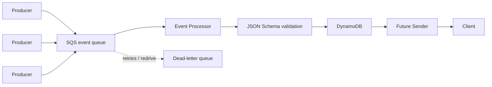

# Event Processor

This project consumes tenant events from SQS, validates them against JSON Schema contracts, and persists valid events in DynamoDB for a future delivery service. It uses SQS redelivery and conditional DynamoDB writes to provide at-least-once processing without losing messages during temporary failures.

See the [verification report](VERIFICATION.md) for captured test results, processor logs, DynamoDB records, queue state, and an explanation of what each result proves.

## Architecture



SQS decouples producers from the processor and supplies durable delivery, retries, and dead-letter handling. The processor owns validation and persistence; JSON Schema files are the event contracts. DynamoDB holds events that are ready for low-latency consumption by the future Sender, which is deliberately outside this assignment.

## Event contract

Every message contains a shared envelope and an event-specific payload:

```json
{
  "event_id": "4e2b37f2-6c9e-4dc5-a669-c3889bff23ec",
  "event_type": "payment.authorized",
  "tenant_id": "merchant-123",
  "destination": "client-a",
  "producer": "authorization-service",
  "occurred_at": "2026-08-24T18:30:00Z",
  "payload": {
    "payment_id": "pay-123",
    "amount": 125.50,
    "currency": "USD"
  }
}
```

The envelope carries identity, tenancy, and eventual routing metadata. Payload rules are selected by `event_type`. JSON Schema keeps those rules declarative, versionable, language-independent, and easy to extend: adding `order.shipped.json` is enough for the processor to recognize that event type after deployment.

## Processing flow

1. A producer sends an event to the SQS queue.
2. The processor long-polls SQS.
3. The common envelope is validated.
4. A schema is selected from the `event_type`.
5. The payload is validated.
6. The event is conditionally persisted in DynamoDB.
7. Only then is the SQS message deleted.
8. Failures are retried and eventually redriven to the DLQ.

Malformed JSON, invalid envelopes, unsupported event types, and invalid payloads are logged separately. They are deliberately left unacknowledged and receive the same bounded SQS retry behavior as other processing failures.

## Reliability

This system provides **at-least-once processing**. The processor does not acknowledge a message until DynamoDB persistence succeeds. If persistence is unavailable, or the process exits before acknowledgment, the SQS visibility timeout expires and the message becomes available again.

SQS can deliver duplicates. `event_id` is therefore the DynamoDB primary key, and writes use `attribute_not_exists(event_id)`. A failed condition means the event was already persisted; the duplicate is treated as successful and acknowledged without overwriting the stored item. Messages that fail three receives are moved to the DLQ by the queue's redrive policy.

## Persistence model

Each item retains the envelope and payload and adds `received_at` plus `status = PENDING`. The table primary key is `event_id`. The `status-received_at-index` GSI uses `status` as its partition key and `received_at` as its sort key, supporting ordered queries for events waiting for the future Sender.

A single `PENDING` GSI partition can become hot at high throughput. It is acceptable for this exercise; larger deployments could shard the status key, partition by tenant, use DynamoDB Streams, or write to a dedicated outbound queue.

## Running locally

Docker and Docker Compose are the only prerequisites; no AWS account is needed.

Start LocalStack, create the queues/table, and run the processor:

```bash
docker compose up --build
```

LocalStack data is ephemeral in this setup. If Docker Desktop or LocalStack restarts, recreate the resources before continuing:

```bash
docker compose run --rm init
docker compose restart processor
```

In another terminal, send valid examples:

```bash
docker compose run --rm processor python scripts/produce_event.py payment.authorized
docker compose run --rm processor python scripts/produce_event.py user.created
```

Send an invalid payment, which will be retried three times before redrive:

```bash
docker compose run --rm processor python scripts/produce_event.py invalid
```

Inspect persisted events:

```bash
docker compose exec localstack awslocal dynamodb scan --table-name events
```

After the invalid event has exhausted its retries, inspect the DLQ message count:

```bash
docker compose exec localstack awslocal sqs get-queue-attributes \
  --queue-url http://localhost:4566/000000000000/events-dlq \
  --attribute-names ApproximateNumberOfMessages
```

## Tests

With the Compose stack running:

```bash
docker compose run --rm processor pytest
```

The tests exercise the four validation failure categories, both supported event types, persistence-before-acknowledgment, retry behavior on persistence failure, and duplicate handling.

## Design decisions

### SQS rather than Kafka or Kinesis

This flow needs durable asynchronous delivery, retries, and a DLQ. It does not currently need replay over retained history, stream analytics, or several independent consumer groups, so Kafka or Kinesis would add operational and implementation cost without serving a stated access pattern.

### JSON Schema

The contract belongs in data files rather than parallel Python validation code. Schemas can be reviewed and versioned independently, and producers in other languages can use the same definitions.

### DynamoDB

The event ID provides a natural key for idempotent writes. A GSI on status and receipt time supports the downstream access pattern without scanning the table.

### Idempotency

A conditional put protects an existing event from overwrite. This handles the common crash-after-write-before-delete case while remaining honest about SQS at-least-once delivery.

## Production considerations

- Define schema compatibility and versioning rules, or introduce a schema registry when coordination requires it.
- Add metrics, tracing, dashboards, and alarms for age, failures, and DLQ depth.
- Provide controlled DLQ inspection, correction, and replay tooling.
- Replace the single pending-status partition with tenant-aware or sharded keys at higher throughput.
- Apply least-privilege IAM, encryption controls, and sensitive-field logging policies.
- Consider DynamoDB Streams or an outbound queue if dispatch needs independent scaling.

## Assumptions

- Ordering between unrelated events is not required.
- `event_id` is globally unique and stable across producer retries.
- The future Sender and client delivery behavior are outside scope.
- Schemas are deployed with the processor; a schema change requires a deployment.
