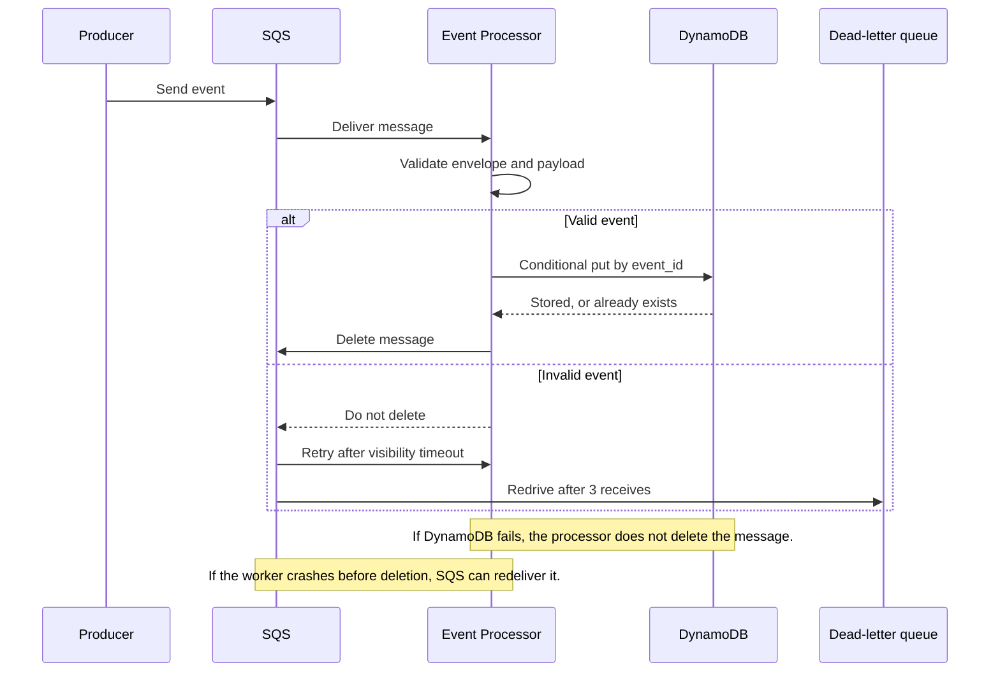

# Verification Report

This report captures one verified local run from August 26, 2026. It records what was tested and what was observed; the [README](README.md) contains the commands needed to reproduce the results.

## What was verified

The run checked the behavior that matters most for this assignment:

1. both supported event types pass JSON Schema validation;
2. valid events reach DynamoDB with tenant and destination metadata;
3. persistence happens before the SQS message is deleted;
4. persistence failure and duplicate delivery are handled safely;
5. invalid events are retried and moved to the DLQ;
6. pending events can be queried through the DynamoDB GSI.

## Processing and failure sequence



The ordering is **validate → persist → delete**. This provides at-least-once processing; it does not claim exactly-once delivery.

## Results summary

| Evidence | Observed result | Meaning |
|---|---:|---|
| Unit tests | 12 passed | Success, validation, failure, and duplicate branches behave as expected |
| LocalStack initialization | Successful | Queues, redrive policy, table, and GSI were created |
| Valid events sent | 2 | Both supported contracts worked end to end |
| DynamoDB items | 2 | Both valid events were persisted |
| Pending-event GSI results | 2 | The future Sender access pattern worked |
| Main queue messages | 0 | No valid message remained unprocessed |
| DLQ messages | 1 | The invalid event was preserved for investigation |

## Automated tests

The complete test suite produced:

```text
............                                                             [100%]
12 passed in 0.12s
```

The tests cover both valid event types and all four validation outcomes. They also check the exact `save` then `delete` order, confirm that persistence failure does not acknowledge the message, and verify the conditional-write duplicate path. These reliability cases are in [test_processor.py](tests/test_processor.py).

## End-to-end evidence

The relevant processor logs were:

```text
Event processed: event_id=e9c336db-2d45-4c65-8f3c-36406e942c8e event_type=payment.authorized tenant_id=merchant-123
Event processed: event_id=1bf71193-9cac-499e-a8a5-ddc78a2899d2 event_type=user.created tenant_id=merchant-123
Event rejected: category=invalid_payload reason=-1 is less than or equal to the minimum of 0
Event rejected: category=invalid_payload reason=-1 is less than or equal to the minimum of 0
Event rejected: category=invalid_payload reason=-1 is less than or equal to the minimum of 0
```

The two valid messages produced these DynamoDB items:

| event_type | event_id | tenant_id | destination | status |
|---|---|---|---|---|
| `payment.authorized` | `e9c336db-2d45-4c65-8f3c-36406e942c8e` | `merchant-123` | `client-a` | `PENDING` |
| `user.created` | `1bf71193-9cac-499e-a8a5-ddc78a2899d2` | `merchant-123` | `client-a` | `PENDING` |

After processing, the main queue contained zero visible or in-flight messages. The DLQ contained one message. This shows that valid messages were acknowledged while the invalid message was retried and retained.

The stored-field checks passed in this local run. Idempotency is covered separately by the conditional-write and duplicate-delivery unit tests; the same event ID was not sent twice during this end-to-end run.

## Viewing DynamoDB data

DynamoDB stores each event as an **item**, with `event_id` as its primary key. Use this command for a compact view:

```bash
docker compose exec -T localstack awslocal dynamodb scan \
  --table-name events \
  --query 'Items[].{event_id:event_id.S,event_type:event_type.S,tenant_id:tenant_id.S,destination:destination.S,status:status.S,received_at:received_at.S}' \
  --output table
```

Use this command to see complete items, including payloads:

```bash
docker compose exec -T localstack \
  awslocal dynamodb scan --table-name events
```

Raw DynamoDB output uses `S` for strings, `N` for numbers, and `M` for nested objects. To retrieve one item, copy its ID from the producer output or the compact table:

```bash
docker compose exec -T localstack awslocal dynamodb get-item \
  --table-name events \
  --key '{"event_id":{"S":"<event-id-from-producer-output>"}}'
```

### What correct data looks like

For each valid event, check that:

- `event_id` matches the producer output;
- `event_type`, `tenant_id`, `destination`, and `payload` are present;
- `status` is `PENDING`;
- `received_at` exists and is later than `occurred_at`;
- the invalid event is absent from the table.

The future Sender access pattern was also checked through `status-received_at-index`; querying `status = PENDING` returned both stored events in receipt-time order.

## Verification boundaries

This is a local functional verification, not a claim of unlimited production scale. The future Sender, load testing, schema compatibility rules, monitoring, security controls, and DLQ replay tooling are outside the assignment.

LocalStack data is ephemeral in this setup. If LocalStack restarts, its resources must be initialized again before the processor resumes.

## Conclusion

The captured run matches the intended behavior: valid events were validated, persisted, indexed, and acknowledged; the invalid event was retried and moved to the DLQ. Unit tests cover persistence failure and duplicate delivery without overstating those cases as part of the end-to-end run.
